###### Microgames, microworlds, and other micro-experiments created in the [PICO-8](https://www.lexaloffle.com/pico-8.php) fantasy console

## Worlds

#### GhostCow
[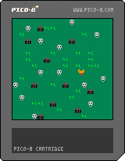](games/ghostcow/)
- ([code](https://github.com/aatishb/microworlds/blob/master/games/ghostcow/sketch.lua)) Uses arrow keys to navigate

## Procedural Art

#### Leaf
[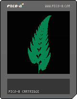](art/leaf/)
- ([code](https://github.com/aatishb/microworlds/blob/master/art/leaf/sketch.lua))

#### CircleDraw
[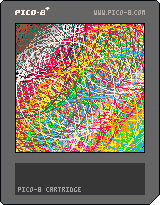](art/circledraw/)
- ([code](https://github.com/aatishb/microworlds/blob/master/art/circledraw/sketch.lua)) Uses arrow keys to navigate

#### Sierpinski Triangle
[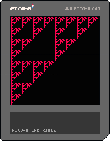](art/sierpinski/)
- ([code](https://github.com/aatishb/microworlds/blob/master/art/sierpinski/sketch.lua))

#### Clouds
[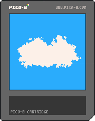](art/clouds/)
- ([code](https://github.com/aatishb/microworlds/blob/master/art/clouds/sketch.lua))

#### Sunspots
[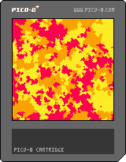](art/sunspots/)
- ([code](https://github.com/aatishb/microworlds/blob/master/art/sunspots/sketch.lua))

#### flame
[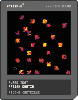](art/flame/)
- ([code](https://github.com/aatishb/microworlds/blob/master/art/flame/sketch.lua))

#### Hyperbola
[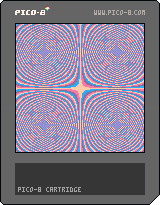](art/hyperbola/)
- ([code](https://github.com/aatishb/microworlds/blob/master/art/hyperbola/sketch.lua))

## Simulation

#### Sandpile (lowres)
[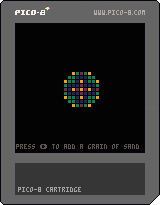](simulation/sandpile-lowres)
- ([code](https://github.com/aatishb/microworlds/blob/master/simulation/sandpile-lowres/sketch.lua))

#### Sandpile
[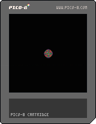](simulation/sandpile)
- ([code](https://github.com/aatishb/microworlds/blob/master/simulation/sandpile/sketch.lua))

#### Percolate
[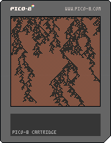](simulation/percolation)
- ([code](https://github.com/aatishb/microworlds/blob/master/simulation/percolation/sketch.lua))

#### Diffusion
[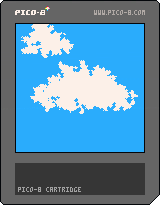](simulation/diffusion)
- ([code](https://github.com/aatishb/microworlds/blob/master/simulation/diffusion/sketch.lua))

#### Cloudrider
- [cloudrider](simulation/cloudrider) ([code](https://github.com/aatishb/microworlds/blob/master/simulation/cloudrider/sketch.lua)) Uses arrow keys to navigate
